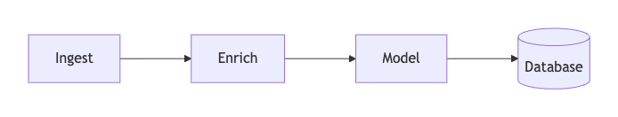
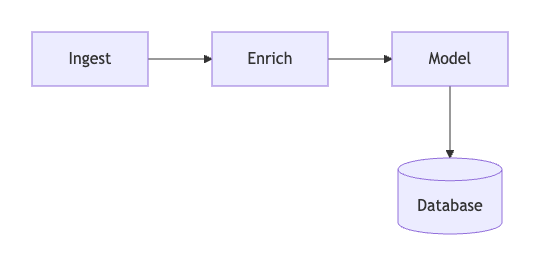
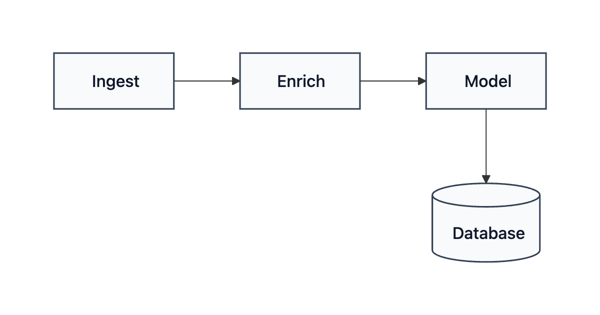
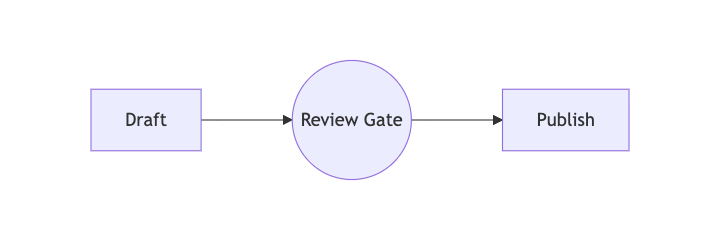
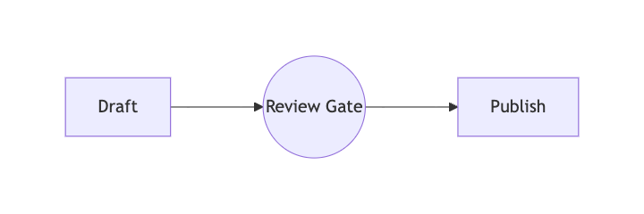

# Straightedge

**Tell your agent how the diagram should look.** Straightedge gives an AI agent deterministic,
editable layout controls for Mermaid while keeping the Mermaid source ordinary and portable.

## Prompt → picture → persistent intent

Start with ordinary Mermaid. There is no Straightedge metadata yet, so Mermaid chooses the default
left-to-right layout.



Tell the agent:

> “Give the three processing stages equal-width boxes. Keep them in a row with 64 pixels between
> them, then put Database 72 pixels below Model.”

The source stays unchanged; the layout changes:



The new sidecar records semantic intent rather than generated coordinates:

```diff
- no pipeline.layout.json
+ {
+   "version": 3,
+   "ops": [
+     { "op": "equalize_size", "nodes": ["ingest", "enrich", "model"],
+       "dimension": "width", "value": 116 },
+     { "op": "resize_node", "node": "db", "width": 104, "height": 76 },
+     { "op": "row_nodes", "nodes": ["ingest", "enrich", "model"],
+       "gap": 64, "align": "center" },
+     { "op": "place_relative", "node": "db", "reference": "model",
+       "side": "below", "gap": 72 }
+   ]
+ }
```

Then tell the agent:

> “Apply the executive-light theme and fit it to a wide README frame.”



That prompt appends two operations; it does not flatten the earlier intent:

```diff
  "ops": [
    ... layout operations above,
+   { "op": "apply_theme", "theme": "executive-light" },
+   { "op": "set_presentation",
+     "presentation": { "preset": "readme-wide", "minFontSize": 12 } }
  ]
```

Shape-aware instructions use the same loop. For example:

> “Make Review Gate about 10% smaller.”

| Before resize | After shape-aware resize |
|---|---|
|  |  |

The agent resolves “10% smaller” from inspected geometry and persists one deterministic operation.
Both dimensions are equal, so the circle stays circular:

```diff
  "ops": [
    { "op": "set_presentation",
      "presentation": { "width": 720, "height": 240, "padding": 24 } },
+   { "op": "resize_node", "node": "review_gate",
+     "width": 94.0921875, "height": 94.0921875 }
  ]
```

The smaller circle is valid but intentionally demonstrates honest diagnostics: the active checks
flag its tighter label padding for review instead of claiming the result is aesthetically perfect.
The pipeline presentation has no blocking problems. Regenerate every image and copied sidecar with
`npm run docs:assets`; the exact inputs live in [examples](./examples/).

Straightedge records visual instructions next to each source:

```text
pipeline.mmd            Mermaid source; Straightedge reads it
pipeline.layout.json    ordered visual intent; safe to remove or reset
pipeline.png            generated render; ignored by Git in examples
```

Coordinates are deliberately not stored. On every render, Straightedge obtains a fresh ELK
baseline, replays semantic operations such as `row_nodes`, `align_nodes`, and `resize_node`, paints
the result in Chromium, and checks the resulting DOM geometry. Stable Mermaid node IDs preserve
intent as labels and structure evolve.

## Project status

`0.2.0-alpha.1` is the initial OSS preview. Its supported scope is Mermaid flowcharts without
subgraphs. Other Mermaid diagram families, org-chart routing, semantic tree layout, multi-user
editing, and remote editor hosting are not supported yet. See [SPEC.md](./SPEC.md),
[ADR-0001](./docs/adr/0001-trust-first-evolution.md), and the implemented initial-release plan in
[ADR-0007](./docs/adr/0007-initial-oss-commit-readiness.md).

Requirements:

- Node.js 22.12 or newer;
- a Chromium browser usable by Puppeteer (`straightedge doctor --json` reports the resolved one);
- macOS or Linux for the current local/CI evidence. CI runs Ubuntu with Node 22.

Chromium's sandbox stays enabled by default. The repository's disposable GitHub-hosted jobs opt
out with `STRAIGHTEDGE_CHROMIUM_NO_SANDBOX=1`; do not use that escape hatch for untrusted diagrams
or on a shared host. See [SECURITY.md](./SECURITY.md).

The npm package name is reserved in metadata but this preview has not been published. Do not use an
`npm install --global straightedge` command until a release exists.

## Run from source

This is the initial-release golden path:

```bash
git clone https://github.com/gmjen/straightedge.git
cd straightedge
npm ci
npm run build
node dist/cli.js doctor
node dist/cli.js render examples/pipeline.mmd
node dist/cli.js edit examples/pipeline.mmd
```

`render` writes PNG beside the source by default. `--svg` writes SVG and `--output <path>` chooses a
different destination. Structured commands accept `--json`. Exit code `0` means no warning or
error was found, `1` means reviewable warnings, and `2` means a blocking diagnostic or runtime/input
failure.

## Conversational edit loop

Inspect first, submit a coherent operation or transaction, then read the returned image and scoped
checks:

```bash
node dist/cli.js inspect chart.mmd
node dist/cli.js align chart.mmd box_a box_b --edge top
node dist/cli.js distribute chart.mmd ingest enrich model database \
  --axis horizontal --order given --gap 24
node dist/cli.js row chart.mmd ingest enrich model database --gap 24
node dist/cli.js stack chart.mmd ceo chief lead --gap 32
node dist/cli.js resize chart.mmd circle_y --scale 0.9
node dist/cli.js history chart.mmd
node dist/cli.js explain chart.mmd
```

Given-order distribution, row, and stack use the listed node order and persist it in sidecar v3.
Old v1/v2 distribute operations with no `order` retain legacy current-position ordering. Preview a
v3 migration with `migrate`; add `--yes` to write it.

Circle resizing is shape-aware: a scale changes both axes, and specifying only width or height
resolves a single diameter. Rectangle dimensions remain independently editable. All resizing is
center-preserving and labels are not scaled.

Use `apply` for one atomic batch:

```bash
node dist/cli.js apply chart.mmd '[
  {"op":"row_nodes","nodes":["a","b","c"],"gap":32},
  {"op":"resize_node","node":"c","width":120}
]' --json
```

The candidate is rendered and checked before one compare-and-swap sidecar write. A skipped ID,
blocking geometry problem, parse failure, or runtime failure leaves the prior bytes unchanged.

## Checks and honest claims

Every JSON and MCP result contains `check.profile`, `check.completed`, named check stages, and a
bounded `check.claim`. A successful result says:

```text
No blocking problems were detected by the active checks.
```

`geometry` checks replay, labels/shapes, overlap/gaps, edges, arrowheads, stale operations, and the
required browser runtime. `presentation` includes those checks plus target-frame readability and
advisories for unusually long connectors, doglegs, edited-direction contradictions, and excessive
frame whitespace. A persisted frame activates `presentation` automatically:

```bash
node dist/cli.js check chart.mmd --profile presentation --json
node dist/cli.js check chart.mmd --profile presentation --suppress <stable-problem-id>
```

Suppression is request-scoped and never hides errors. A `clean` status means the active checks
reported nothing, `review` means warnings require judgment, and `failed` means a blocking issue or
required-stage failure.

## Safe history, undo, and reset

`history` reports whether every operation is effective, overridden, partially overridden, or
skipped. `explain` summarizes source direction, effective ordering, presentation policy, redundant
intent, and edits that oppose or later adjust earlier intent.

Undo replays and renders the candidate before atomically removing the final operation. Reset is
preview-only unless explicitly confirmed:

```bash
node dist/cli.js undo chart.mmd
node dist/cli.js reset chart.mmd                 # preview; no write
node dist/cli.js reset chart.mmd --yes           # move sidecar into .straightedge/backups/
node dist/cli.js restore chart.mmd <backup-path> # preview
node dist/cli.js restore chart.mmd <backup-path> --yes
```

`reset --yes --no-backup` is intentionally explicit and unrecoverable. Local backup state is
ignored by Git.

## Local editor

`node dist/cli.js edit chart.mmd` starts a token-protected server bound only to `127.0.0.1`. The
editor and agent surfaces share the same transaction engine. It supports drag, partial and
shape-aware resize, numbered selection order, align/distribute/row/stack, safe repair, transactional
undo, session redo, recoverable reset, viewport-only zoom/fit, and inline errors.

Unsaved Mermaid source is visibly marked. Any layout action or refresh offers **Save and apply**,
**Discard and apply**, or **Cancel**; render responses cannot overwrite a dirty draft. Textarea
undo remains native, while Cmd/Ctrl+Z and Cmd/Ctrl+Shift+Z operate on layout history when focus is
outside text entry.

## Connect an AI agent with MCP

Build from source, then configure an MCP client with the absolute CLI path:

```json
{
  "mcpServers": {
    "straightedge": {
      "command": "node",
      "args": ["/absolute/path/to/straightedge/dist/cli.js", "mcp"]
    }
  }
}
```

The intended journey is inspect → describe visual intent → submit one semantic transaction →
examine the rendered image and structured result → refine or undo. The MCP server exposes the same
row, stack, distribute, resize, history, explain, undo, reset-preview, and restore behavior as the
CLI.

## Development and security

```bash
npm test              # fast domain tests
npm run test:coverage # baseline Node coverage report
npm run test:e2e      # real Chromium, CLI, transaction, and editor flows
npm run test:docs     # links, policy files, and visual dimensions
npm run test:package  # pack, clean install, CLI/API/types consumer smoke
npm run test:all      # complete local release gate
```

Straightedge has no telemetry and sends no diagram to a Straightedge service. The editor is not
safe to expose remotely. Mermaid uses strict security mode with HTML labels disabled; callers
should still avoid untrusted source. See [SECURITY.md](./SECURITY.md) for the private reporting
channel and [CONTRIBUTING.md](./CONTRIBUTING.md) for fixture and pull-request guidance.

## License

Copyright 2026 Greg Jennings. Licensed under the [Apache License 2.0](./LICENSE).
