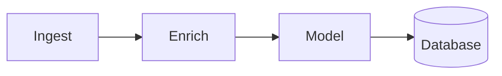

# Straightedge v0.1 — Specification

**Straightedge lets you tell an AI agent how you want your Mermaid diagram laid out.**

Mermaid describes what the diagram means. Straightedge records what you said about how it
should look. Both live in files next to each other, both are readable, and the picture is a
pure function of the two.

---

## 1. Engineering intent

This spec optimizes for one thing: **a reader should be able to hold the whole system in their
head.** Everything else — performance, extensibility, backwards compatibility, error taxonomy —
is explicitly deprioritized for v0.1.

We expect to rearchitect. The goal is to be *cheap to rearchitect*, which comes from being small
and obvious, not from being abstract.

**Hard rules for v0.1 code:**

1. **No abstraction with one implementation.** No interfaces, no strategy patterns, no plugin
   points, no dependency injection. If there is one layout engine, call it directly.
2. **Every layout operation is a pure function** with the identical signature
   `(Layout, Params) => Layout`. No classes, no mutation, no side effects.
3. **No caching, no incremental anything.** Every render recomputes from scratch. If it's slow,
   that's a v0.2 problem and we'll have real numbers to work from.
4. **No error taxonomy.** `throw new Error("readable sentence")`. No error codes, no custom error
   classes, no recovery paths.
5. **All types in one file** (`types.ts`), under 150 lines, readable in one sitting. The data
   model *is* the design.
6. **No configuration.** No config file, no env vars, no options objects with 12 optional fields.
   Constants live at the top of the file that uses them.
7. **Every deliberate shortcut gets a `// LIMITATION:` comment** explaining what breaks and
   roughly what fixing it would involve. This is how we stay honest and how the next person knows
   a rough edge is a decision, not a bug.
8. **Budget: ~1,200 lines of TypeScript total, excluding tests.** If we're over, we're building
   the wrong thing. This is a forcing function, not a law.

**Explicit non-goals for v0.1:** custom edge routing, subgraphs/clusters, diagram types other
than flowchart, cross-machine pixel determinism, a constraint solver, a visual editor, a stable
file format, a public API, incremental render, concurrent access, useful behavior on diagrams
larger than ~40 nodes.

---

## 2. Success criterion

v0.1 is done when this transcript works, end to end, and the final image looks good enough to
paste into a slide:

```
You:    Diagram the ingestion pipeline: ingest, enrich, model, and a database.

Agent:  → create_diagram("pipeline.mmd", "flowchart LR ...")
        → render("pipeline.mmd")
        [image: four boxes in a row, database awkwardly at the end]

You:    Put the database below the model, align the top three, and make them the same width.

Agent:  → inspect("pipeline.mmd")
        → equalize_size(["ingest","enrich","model"], "width")
        → distribute_nodes(["ingest","enrich","model"], "horizontal", gap: 64)
        → place_relative("db", "model", "below", gap: 80)
        [image: clean row of three equal boxes, database centered underneath]

You:    Nudge the database right a bit.

Agent:  → move_node("db", dx: 24, dy: 0)
        [image: same, database shifted right]
```

That's the whole product. Nothing else in this spec matters if that loop doesn't feel good.

Note what the agent did *not* have to do: read SVG, compute coordinates, learn a DSL, or write a
YAML file. And note that the layout survives being written to disk and rendered again tomorrow.

---

## 3. Concepts

Five nouns. This vocabulary is used consistently everywhere, including in code identifiers.

| Term | Meaning |
|---|---|
| **Source** | The `.mmd` file. Ordinary Mermaid. Straightedge never writes to it. |
| **Baseline** | The geometry ELK produces from the source alone. Recomputed on every render, never stored. |
| **Op** | One recorded layout instruction, e.g. `move_node`. A pure function from Layout to Layout. |
| **Op log** | The ordered list of ops, stored in `<name>.layout.json`. This is the only thing Straightedge persists. |
| **Layout** | Resolved geometry: every node's `x, y, width, height`, plus edge paths. What gets painted. |

The central equation:

```
Layout = replay(Baseline, OpLog)
```

Baseline is recomputed, ops are replayed in order, and the result is painted. There is no stored
geometry anywhere. That single decision is what makes the rest of the system small.

### 3.1 Why an op log instead of stored coordinates

The obvious design is to store the resulting positions:

```json
{ "db": { "x": 640, "y": 300 } }
```

We don't, because those numbers are anchored to a baseline that stops existing the moment anyone
edits the `.mmd`. Add one node, ELK re-lays-out, and your saved coordinates now describe a layout
nobody has ever seen — stranded nodes, overlaps, alignments that quietly stopped being aligned.

Storing the *instructions* instead gets us, for free and with no solver:

- **Durability.** `align_nodes` replayed against a new baseline simply re-aligns. Structural
  intent survives semantic edits without a constraint language.
- **Graceful ID drift.** An op naming a node that no longer exists is skipped with a warning. The
  other fifteen ops still apply.
- **Order preservation.** Align-then-distribute and distribute-then-align are different results.
  A log keeps that; a coordinate blob loses it.
- **`undo` and `reset` for free.** Pop the last op; truncate the array.
- **Readable diffs.** `+ { "op": "align_nodes", ... }` in a PR means something.

The cost is that ops must be replayed from a fresh baseline every time, which is why rule 3 above
forbids caching. The two decisions hold each other up.

---

## 4. Files

Two files per diagram, side by side, same basename:

```
pipeline.mmd            ← Mermaid. Yours. We only read it.
pipeline.layout.json    ← Op log. Ours. Safe to delete.
```

Delete the `.layout.json` and you have a plain Mermaid diagram with default layout. Nothing is
lost that you didn't explicitly ask for.

### 4.1 Op log format

```json
{
  "version": 1,
  "ops": [
    { "op": "equalize_size",  "nodes": ["ingest", "enrich", "model"], "dimension": "width" },
    { "op": "distribute_nodes", "nodes": ["ingest", "enrich", "model"], "axis": "horizontal", "gap": 64 },
    { "op": "place_relative", "node": "db", "reference": "model", "side": "below", "gap": 80 },
    { "op": "move_node",      "node": "db", "dx": 24, "dy": 0 }
  ]
}
```

That's the entire format. No metadata, no timestamps, no authorship, no schema URL. `version` is
there so we can recognize a v0.1 file later; v0.1 refuses anything that isn't `1`.

---

## 5. Coordinate conventions

Stated once, obeyed everywhere. Most layout bugs are convention bugs.

- Origin is top-left. **x increases right, y increases down.**
- A node's `x, y` is its **top-left corner**, not its center.
- All values are **CSS pixels**, floating point. We do not round until paint time.
- Derived values used throughout: `right = x + width`, `bottom = y + height`,
  `centerX = x + width / 2`, `centerY = y + height / 2`.
- The canvas is computed *after* replay as the bounding box of all nodes and edges, expanded by
  `PADDING = 32`, then translated so the top-left is `(0, 0)`. Nodes may legitimately hold
  negative coordinates mid-replay; that is fine and is normalized away at the end.

---

## 6. The render pipeline

Six steps. `render()` is the only orchestration in the codebase, and it should read like this
list.

```
1. parse      source .mmd            → Mermaid LayoutData (nodes, edges, config)
2. baseline   LayoutData             → Layout            (ELK, via elkjs)
3. load       <name>.layout.json     → Op[]
4. replay     (Layout, Op[])         → Layout + warnings
5. edges      Layout                 → Layout            (re-anchor moved edges)
6. paint      Layout                 → SVG, then PNG     (Mermaid's paint helpers, in Chromium)
```

**Invariant:** steps 2–5 are pure. Given the same `LayoutData` and the same op log they produce
identical geometry, on any machine, with no I/O. Steps 1 and 6 touch Chromium and are the only
impure parts. This is worth protecting — it means the interesting half of the system is testable
without a browser, and the test suite runs in milliseconds.

### 6.1 Why a Mermaid layout plugin

We register with `mermaid.registerLayoutLoaders()` and receive Mermaid's `LayoutData`, the same
way the official `@mermaid-js/layout-elk` package does. This means we do **not** reimplement
Mermaid's flowchart parser, and we do **not** reimplement SVG painting — we hand resolved
geometry back to Mermaid's own paint helpers.

It also means we participate in layout *before* edges are drawn, which is the reason this
approach works at all. Post-processing the finished SVG cannot work: moving a node's `<g
transform>` leaves its edges pointing at where the node used to be.

### 6.2 Runtime

Node 20+, TypeScript, ESM. Mermaid measures text with real DOM font metrics, so rendering runs in
**headless Chromium via Puppeteer**. This is a heavy dependency and slow to start (roughly 300ms–1s
per render), and we accept both. The alternative — jsdom with estimated text widths — produces
wrong node sizes, and node sizes are an *input* to layout, so every downstream coordinate would be
wrong. Bad geometry is not a tradeoff we can make.

---

## 7. Operations

Seven ops. Each is a pure function in `ops.ts` and each maps to exactly one MCP tool.

The set is deliberately small. Everything here is something you'd say out loud to a designer.

### `move_node`

```ts
{ op: "move_node", node: string, dx: number, dy: number }
```

Translates one node. **Relative, not absolute** — a delta still means something against a changed
baseline, where an absolute position doesn't.

```
node.x += dx
node.y += dy
```

### `resize_node`

```ts
{ op: "resize_node", node: string, width?: number, height?: number }
```

Sets absolute dimensions. **Center-preserving:** the node grows outward in both directions rather
than dragging its bottom-right corner, because that's what "make this box wider" means to a
person.

```
cx = centerX(node); cy = centerY(node)
node.width  = width  ?? node.width
node.height = height ?? node.height
node.x = cx - node.width / 2
node.y = cy - node.height / 2
```

### `align_nodes`

```ts
{ op: "align_nodes", nodes: string[], edge: "left"|"right"|"top"|"bottom"|"centerX"|"centerY" }
```

**The first node in `nodes` is the anchor and does not move.** Every other node translates along
one axis only to match the anchor's chosen edge.

We chose "first node anchors" over "align to the extreme" or "align to the mean" because it's
predictable and it gives the agent control: to align to a specific node, list it first. The cost
is that `align_nodes([a,b,c])` and `align_nodes([c,b,a])` differ — which is correct, and worth the
small surprise.

| `edge` | assignment for each non-anchor node `n` |
|---|---|
| `left` | `n.x = a.x` |
| `right` | `n.x = right(a) - n.width` |
| `centerX` | `n.x = centerX(a) - n.width / 2` |
| `top` | `n.y = a.y` |
| `bottom` | `n.y = bottom(a) - n.height` |
| `centerY` | `n.y = centerY(a) - n.height / 2` |

"Put these on the same row" is `align_nodes(nodes, "centerY")`.

### `distribute_nodes`

```ts
{ op: "distribute_nodes", nodes: string[], axis: "horizontal"|"vertical", gap?: number }
```

Nodes are first **sorted by their current position** along `axis` — not by list order, since the
agent shouldn't have to know the current arrangement to space things evenly.

- **`gap` given:** pack. The first node stays put; each subsequent node's leading edge is placed
  `gap` after the previous node's trailing edge.
- **`gap` omitted:** equalize. The first and last nodes stay put and the space between them is
  divided evenly:
  `gap = (span - Σ sizes) / (count - 1)`, where `span = trailing(last) - leading(first)`.

If the nodes don't fit, `gap` goes negative and they overlap. We don't clamp it — `check_layout`
will report the overlap, and silently ignoring the instruction would be worse than showing an
obviously wrong picture.

### `equalize_size`

```ts
{ op: "equalize_size", nodes: string[], dimension: "width"|"height"|"both", value?: number }
```

`value` defaults to the **maximum** among the listed nodes, so labels never get clipped. Applied
center-preserving, exactly like `resize_node`.

### `place_relative`

```ts
{
  op: "place_relative",
  node: string, reference: string,
  side: "above"|"below"|"left"|"right",
  gap: number,
  crossAxis?: "center" | "keep"   // default "center"
}
```

One op covers `place_below`, `place_above`, `place_left_of`, `place_right_of`. The reference does
not move.

```
below:  node.y = bottom(ref) + gap
above:  node.y = ref.y - gap - node.height
right:  node.x = right(ref) + gap
left:   node.x = ref.x - gap - node.width
```

With `crossAxis: "center"` the node is also centered on the reference's other axis — so "put
storage underneath the workers" lands centered, which is what was meant. `"keep"` leaves the other
axis alone.

### `set_node_style`

```ts
{ op: "set_node_style", node: string, style: { fill?, stroke?, strokeWidth?, radius?, textColor?, fontWeight? } }
```

The one non-geometric op. It lives in the same log for simplicity and is applied at paint time,
not during replay. Values are passed through to SVG attributes without validation.

`radius` is a corner radius in px and only affects rectangular shapes.

---

## 8. Replay

The entire engine:

```ts
export function replay(baseline: Layout, ops: Op[]): { layout: Layout; warnings: string[] } {
  let layout = baseline;
  const warnings: string[] = [];

  for (const [i, op] of ops.entries()) {
    const missing = nodeIdsIn(op).filter((id) => !layout.nodes[id]);
    if (missing.length > 0) {
      warnings.push(`op ${i} (${op.op}) skipped: no node ${missing.join(", ")}`);
      continue;   // one stale op must never invalidate the rest of the log
    }
    layout = applyOp(layout, op);
  }

  return { layout, warnings };
}
```

That `continue` is the whole ID-drift story. A renamed or deleted node costs you the ops that
mentioned it and nothing else.

### 8.1 Op order matters, and that's the honest tradeoff

Ops are commands, not constraints. They describe what to do, evaluated in sequence — which means a
later op can undo an earlier op's intent. From the worked example below:

```
place_relative(db, model, below)   → db centered under model
distribute_nodes([ingest,enrich,model])  → model moves left; db is now off-center
```

This is inherent to the commands model and we accept it in v0.1. Two mitigations, in order of
preference:

1. Coarse before fine. Sizing, then distribution, then relative placement, then nudges. The MCP
   tool descriptions say so, which is enough to steer most agents.
2. Re-apply the op. `place_relative` again appends a second op and re-centers.

The permanent fix is re-evaluating structural ops after every replay pass until stable — which is
a solver, which is v0.2 at the earliest, and only if this actually annoys us in practice.

---

## 9. Edges

The only genuinely hard part, and we're going to mostly dodge it.

**Rule:** after replay, for each edge, if either endpoint node was touched by any op, discard ELK's
waypoints and draw a straight line between the two node centers, clipped to each node's boundary.
Edges whose endpoints were untouched keep ELK's original routing.

```ts
// LIMITATION: no routing. A re-anchored edge will happily pass straight through
// an unrelated node. check_layout reports it; the human moves something.
// Fixing this properly means an orthogonal router with obstacle avoidance (~400 lines,
// and it becomes the largest module in the project). Not v0.1.
```

On the 5–15 node diagrams this tool is for, straight re-anchored edges look fine. On dense graphs
they look bad. We ship anyway, and let that pain decide whether routing is worth building.

We do **not** expose `set_edge_port`, `add_waypoint`, or `set_edge_route` in v0.1. Node placement
is where nearly all the value is, and edge controls would double the tool surface for the last 15%.

---

## 10. MCP surface

Twelve tools. Named tools rather than one generic `apply_op(json)` envelope, because tool schemas
are how an agent *learns* the vocabulary — a well-named tool with three typed parameters gets
called correctly far more often than a discriminated union.

**Design rule: every mutating tool re-renders and returns the image.** This is the single most
important decision in the MCP layer. An agent that can see what it just did will fix its own
mistakes; an agent flying blind makes you the feedback loop. The image comes back as MCP image
content alongside the warnings.

| Tool | Params | Returns |
|---|---|---|
| `create_diagram` | `path`, `mermaid` | node ids, edge ids, image |
| `render` | `path`, `format?` (`png`\|`svg`) | image, warnings |
| `inspect` | `path` | every node's `x/y/width/height`, edge endpoints, the op log |
| `check_layout` | `path` | overlaps, near-collisions, edge/node crossings, stale ops |
| `move_node` | `node`, `dx`, `dy` | image, warnings |
| `resize_node` | `node`, `width?`, `height?` | image, warnings |
| `align_nodes` | `nodes[]`, `edge` | image, warnings |
| `distribute_nodes` | `nodes[]`, `axis`, `gap?` | image, warnings |
| `equalize_size` | `nodes[]`, `dimension`, `value?` | image, warnings |
| `place_relative` | `node`, `reference`, `side`, `gap`, `crossAxis?` | image, warnings |
| `set_node_style` | `node`, `style` | image, warnings |
| `undo` | `path` | image, warnings |
| `reset_layout` | `path` | image (baseline) |

Every mutating tool also takes `path`. Omitted from the table for readability.

`inspect` is what the agent calls first, always. Tool descriptions should say so explicitly —
guessing at node ids is the most common way this loop fails.

### 10.1 Agent instructions the server should ship

The MCP server exposes a short instructions block. Two lines earn their keep:

> When editing an existing diagram, preserve existing Mermaid node IDs unless the thing they
> represent has genuinely changed. IDs are layout identity; labels are free to change.
>
> Prefer semantic snake_case IDs with bracketed labels — `primary_db["Postgres"]`, not `db1`.

Mermaid already separates id from label, so this costs the agent nothing and it's most of why ID
drift stays rare in practice.

---

## 11. CLI

```bash
straightedge render  pipeline.mmd [-o out.png] [--svg]
straightedge inspect pipeline.mmd          # node ids + geometry, human-readable
straightedge check   pipeline.mmd          # lint report, non-zero exit if problems
straightedge reset   pipeline.mmd          # delete the op log
straightedge mcp                           # start the MCP server on stdio
```

`render` with no `-o` writes `<name>.png` beside the source. Five commands, no flags beyond these.

---

## 12. Code layout

One package, `straightedge`. No monorepo, no workspaces — there is no second consumer yet, and
splitting packages before you have one is how projects get slow to change.

```
src/
  types.ts      ~130 lines   Layout, Node, Edge, Op union. The whole data model.
  geometry.ts    ~60 lines   right/bottom/centre, overlap, segment-hits-box, boundary clipping.
  ops.ts        ~200 lines   One pure function per op. The heart of the project.
  replay.ts      ~40 lines   Fold ops over baseline; collect warnings.
  canvas.ts      ~50 lines   Normalize to positive coordinates; size the canvas.
  edges.ts       ~40 lines   Re-anchor rule for edges whose endpoints moved.
  lint.ts       ~100 lines   Overlaps, near-collisions, edge/node crossings.
  store.ts       ~60 lines   Read/write <name>.layout.json.
  baseline.ts   ~120 lines   Mermaid LayoutData → elkjs → Layout.
  paint.ts      ~120 lines   Layout → SVG via Mermaid's paint helpers.
  render.ts     ~100 lines   The six steps, and nothing else.
  cli.ts        ~100 lines
  mcp.ts        ~180 lines   Twelve tool registrations, thin wrappers over ops.
  index.ts       ~10 lines   Deliberately thin. There is no supported API in v0.1.
```

Everything above `baseline.ts` — the first eight files — has **no Mermaid, ELK, or Chromium
dependency** and is unit-testable in milliseconds. That's roughly half the codebase and all of the
logic worth testing. Protect that boundary; it's the most valuable structural property here.

Tests: one file, `test/ops.test.ts`. Assert the worked example in §13 to the pixel, plus the
handful of behaviours that would be silently wrong if reversed (centre-preserving resize,
first-node-anchors alignment, sort-by-position distribution, stale-op skipping). No coverage
targets, no CI matrix. If this file ever needs a mock, something has leaked out of `ops.ts`.

### 12.1 Dependencies

`mermaid`, `elkjs`, `puppeteer`, `@modelcontextprotocol/sdk`, `zod`, `commander`. Nothing else.

Pin **exact** versions of `mermaid` and `elkjs`. The layout-loader API is public but young, and
`LayoutData` and the paint helpers are semi-internal — expect breakage on minor bumps and treat
upgrading as a deliberate task, not a dependabot merge.

---

## 13. Worked example

Source, `pipeline.mmd`:



**Baseline** (ELK, `layout: LR`, illustrative sizes):

| node | x | y | w | h |
|---|---|---|---|---|
| ingest | 0 | 0 | 96 | 54 |
| enrich | 176 | 0 | 100 | 54 |
| model | 356 | 0 | 92 | 54 |
| db | 528 | 0 | 128 | 54 |

**Op log:**

```json
{
  "version": 1,
  "ops": [
    { "op": "place_relative", "node": "db", "reference": "model", "side": "below", "gap": 80 },
    { "op": "equalize_size", "nodes": ["ingest", "enrich", "model"], "dimension": "width" },
    { "op": "distribute_nodes", "nodes": ["ingest", "enrich", "model"], "axis": "horizontal", "gap": 64 },
    { "op": "move_node", "node": "db", "dx": 24, "dy": 0 }
  ]
}
```

**Replay, step by step:**

1. `place_relative` — `db.y = 0 + 54 + 80 = 134`; centered on model:
   `db.x = 402 - 64 = 338`
2. `equalize_size` — max width is 100. `ingest` grows 96→100 about its center 48, so
   `x = -2`. `model` grows 92→100 about center 402, so `x = 352`. `enrich` unchanged.
3. `distribute_nodes` — sorted by x: `ingest(-2), enrich(176), model(352)`. Pack at gap 64:
   `ingest.x = -2` (anchor), `enrich.x = 162`, `model.x = 326`
4. `move_node` — `db.x = 362`

**Resolved, before canvas normalization:**

| node | x | y | w | h |
|---|---|---|---|---|
| ingest | -2 | 0 | 100 | 54 |
| enrich | 162 | 0 | 100 | 54 |
| model | 326 | 0 | 100 | 54 |
| db | 362 | 134 | 128 | 54 |

**Canvas normalization** — bbox is x ∈ [-2, 490], y ∈ [0, 188]. Translate by `+34, +32` for
`PADDING = 32`. Final canvas: 556 × 252.

| node | x | y |
|---|---|---|
| ingest | 32 | 32 |
| enrich | 196 | 32 |
| model | 360 | 32 |
| db | 396 | 166 |

Note that `db`'s center is now 460 while `model`'s is 410 — the database is 50px right of the
model, not centered under it. Twenty-four of those pixels are the deliberate nudge; the other
twenty-six are `distribute_nodes` having moved `model` *after* `db` was placed relative to it.
This is §8.1 in the concrete, and it's exactly the class of thing a durable constraint would fix
and a command won't. Reordering the log so `place_relative` runs last produces the centered result.

> Every number in this section is asserted in `test/ops.test.ts` and passes against the
> implementation in `src/`. If you change an op's semantics, this test is what tells you.

---

## 14. What we know is broken

Written down so nobody has to rediscover it, and so a bug report can be triaged in ten seconds.

- **Edges don't route.** A re-anchored edge can pass through an unrelated node. §9.
- **Structural ops don't re-evaluate.** Op order can undo earlier intent. §8.1.
- **Subgraphs are unsupported.** `subgraph` blocks parse but ops on nodes inside a cluster will
  produce wrong geometry. Reject them in `baseline.ts` with a clear message rather than rendering
  garbage.
- **Flowcharts only.** Other diagram types are rejected at parse.
- **Layout is font-dependent.** Different fonts or platforms mean different label metrics, so
  different node sizes and therefore different coordinates. Reproducible on one machine;
  not across machines. Real determinism needs embedded fonts and is out of scope.
- **Deleted node loses its ops.** They're skipped with a warning, never recovered. No fuzzy
  rematching by label or topology.
- **No canvas control.** No aspect ratio, no fixed dimensions, no presets. Canvas is bbox + 32px.
- **Slow.** Roughly 300ms–1s per render, all of it Chromium startup. Unoptimized on purpose.
- **Not concurrency-safe.** Two processes editing one op log will lose ops. Don't do that.

---

## 15. Open questions

Genuinely undecided. Each should be settled by building, not by discussion.

1. **Should the op log live in the `.mmd` frontmatter instead of a sidecar?** Mermaid supports a
   YAML frontmatter block, so one self-contained file is possible and would be nicer for
   README-embedded diagrams. Sidecar for v0.1 because it keeps the source untouched — revisit once
   there are real users.
2. **Is `align_nodes(nodes, "centerY")` the right spelling for "same row"?** A `same_row` alias
   would read better to an agent but adds a second name for one concept. Watch which one agents
   reach for.
3. **Should mutating tools be batchable?** Four ops means four Chromium renders. An `apply_ops`
   batch would help, at the cost of the every-mutation-returns-an-image rule. Measure first.
4. **PNG or SVG by default?** PNG for v0.1 since it's what agents and chat surfaces can display.
   SVG matters more for docs pipelines, which aren't the v0.1 user.
5. **When does the first durable constraint appear?** Best guess: `align_nodes` becomes
   re-evaluating before anything else does, because misalignment after a semantic edit is the most
   visible failure. Wait for it to actually annoy someone.

---

## 16. Acceptance checklist

```
□ mermaid.registerLayoutLoaders registers "straightedge" and renders an unmodified flowchart
□ Moving a node causes its edges to follow          ← the real unknown; spike this first
□ replay() is pure and covered by the §13 worked example, asserted to the pixel
□ A stale op warns and is skipped; other ops still apply
□ Every MCP mutating tool returns an image
□ check_layout catches a deliberately created overlap
□ Deleting the .layout.json returns the diagram to baseline
□ The §2 transcript works, unassisted, in a real agent session
□ Total src/ is under ~1,200 lines
```

The second box is the one that decides whether the project exists. Build that before anything
else — registration will work; edge participation is the actual bet.

---

**License:** BSD-3-Clause
